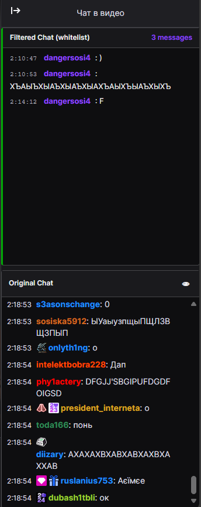
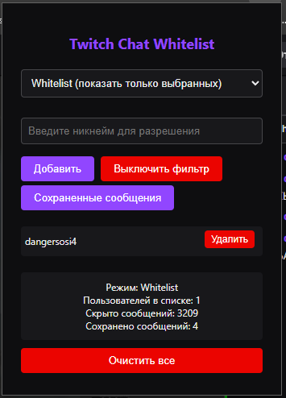

# Twitch Chat Filter Extension

A Chrome extension that provides advanced chat filtering for Twitch streams with dual chat view functionality.

## 🌍 Languages | Языки
- [English](#english)
- [Русский](#русский)

---

## English

### 📷 Screenshots


*Dual chat view showing filtered and original chat side by side*


*Extension popup with filtering settings and saved messages*

### ✨ Features

- **Dual Chat Display**: View filtered and original chat simultaneously in split view
- **Two Filtering Modes**:
  - **Whitelist Mode**: Show only messages from selected users
  - **Blacklist Mode**: Hide messages from selected users
- **Message Saving**: Automatically save messages from whitelisted users
- **Real-time Filtering**: Instant filtering of new messages as they appear
- **Customizable Interface**: Toggle original chat visibility, modern dark theme
- **Statistics Tracking**: Count filtered and saved messages
- **Cross-Platform**: Works on both live streams and VODs

### 🚀 Installation

1. Download or clone this repository
2. Open Chrome and navigate to `chrome://extensions/`
3. Enable "Developer mode" in the top right
4. Click "Load unpacked" and select the extension folder
5. The extension icon will appear in your Chrome toolbar

### 🎯 How to Use

1. **Navigate to any Twitch stream or VOD**
2. **Click the extension icon** in your Chrome toolbar
3. **Choose filtering mode**:
   - Select "Whitelist" to show only specific users
   - Select "Blacklist" to hide specific users
4. **Add usernames** to your filter list
5. **Enable the filter** with the toggle button
6. **View results** in the dual chat layout

### 🔧 Configuration

- **Mode Selection**: Switch between Whitelist and Blacklist modes
- **User Management**: Add/remove users from filter lists
- **Filter Toggle**: Enable/disable filtering without losing settings
- **Original Chat Toggle**: Hide/show original chat using the eye button
- **Saved Messages**: View saved messages from whitelisted users

### 📱 Compatibility

- **Browsers**: Chrome, Chromium-based browsers
- **Twitch**: Live streams, VODs, all channel types
- **Responsive**: Works on desktop and mobile layouts

### 🛠️ Technical Details

- **Manifest Version**: 3
- **Permissions**: Storage, Active Tab, Twitch.tv host access
- **Real-time Processing**: DOM mutation observers for instant filtering
- **Data Persistence**: Settings and messages saved locally
- **Performance Optimized**: Minimal impact on page performance

### 🤝 Contributing

1. Fork the repository
2. Create a feature branch (`git checkout -b feature/amazing-feature`)
3. Commit your changes (`git commit -m 'Add amazing feature'`)
4. Push to the branch (`git push origin feature/amazing-feature`)
5. Open a Pull Request

### 📄 License

This project is licensed under the MIT License - see the [LICENSE](LICENSE) file for details.

### 🐛 Bug Reports

Found a bug? Please create an issue with:
- Steps to reproduce
- Expected vs actual behavior
- Browser and extension version
- Twitch page URL where the issue occurred

---

## Русский

### 📷 Скриншоты


*Двойной вид чата с отфильтрованными и оригинальными сообщениями*


*Всплывающее окно расширения с настройками фильтрации и сохраненными сообщениями*

### ✨ Возможности

- **Двойной вид чата**: Просмотр отфильтрованного и оригинального чата одновременно
- **Два режима фильтрации**:
  - **Режим Whitelist**: Показ только сообщений от выбранных пользователей
  - **Режим Blacklist**: Скрытие сообщений от выбранных пользователей
- **Сохранение сообщений**: Автоматическое сохранение сообщений от пользователей из whitelist
- **Фильтрация в реальном времени**: Мгновенная фильтрация новых сообщений
- **Настраиваемый интерфейс**: Переключение видимости оригинального чата, современная темная тема
- **Отслеживание статистики**: Подсчет отфильтрованных и сохраненных сообщений
- **Кроссплатформенность**: Работает на live-стримах и VOD

### 🚀 Установка

1. Скачайте или клонируйте этот репозиторий
2. Откройте Chrome и перейдите на `chrome://extensions/`
3. Включите "Режим разработчика" в правом верхнем углу
4. Нажмите "Загрузить распакованное расширение" и выберите папку расширения
5. Иконка расширения появится в панели инструментов Chrome

### 🎯 Как использовать

1. **Перейдите на любой стрим или VOD на Twitch**
2. **Нажмите на иконку расширения** в панели инструментов Chrome
3. **Выберите режим фильтрации**:
   - Выберите "Whitelist" для показа только определенных пользователей
   - Выберите "Blacklist" для скрытия определенных пользователей
4. **Добавьте никнеймы** в список фильтрации
5. **Включите фильтр** кнопкой переключения
6. **Просматривайте результаты** в двойном виде чата

### 🔧 Настройка

- **Выбор режима**: Переключение между режимами Whitelist и Blacklist
- **Управление пользователями**: Добавление/удаление пользователей из списков фильтрации
- **Переключение фильтра**: Включение/отключение фильтрации без потери настроек
- **Переключение оригинального чата**: Скрытие/показ оригинального чата кнопкой-глазом
- **Сохраненные сообщения**: Просмотр сохраненных сообщений от пользователей из whitelist

### 📱 Совместимость

- **Браузеры**: Chrome, браузеры на основе Chromium
- **Twitch**: Live-стримы, VOD, все типы каналов
- **Адаптивность**: Работает на десктопных и мобильных макетах

### 🛠️ Технические детали

- **Версия манифеста**: 3
- **Разрешения**: Storage, Active Tab, доступ к хосту Twitch.tv
- **Обработка в реальном времени**: DOM mutation observers для мгновенной фильтрации
- **Сохранение данных**: Настройки и сообщения сохраняются локально
- **Оптимизированная производительность**: Минимальное влияние на производительность страницы

### 🤝 Участие в разработке

1. Сделайте fork репозитория
2. Создайте ветку для новой функции (`git checkout -b feature/amazing-feature`)
3. Зафиксируйте изменения (`git commit -m 'Добавить amazing feature'`)
4. Отправьте в ветку (`git push origin feature/amazing-feature`)
5. Откройте Pull Request

### 📄 Лицензия

Этот проект лицензирован под лицензией MIT - подробности см. в файле [LICENSE](LICENSE).

### 🐛 Сообщения об ошибках

Нашли ошибку? Пожалуйста, создайте issue с:
- Шагами для воспроизведения
- Ожидаемым и фактическим поведением
- Версией браузера и расширения
- URL страницы Twitch, где произошла ошибка

---

## 📁 File Structure

```
twitch-chat-filter/
├── manifest.json          # Extension configuration
├── popup.html             # Extension popup interface
├── popup.js               # Popup logic
├── content.js             # Main filtering logic
├── styles.css             # Custom chat styles
├── screenshots/           # Screenshots folder
│   ├── dual-chat-view.png
│   └── extension-popup.png
├── icons/                 # Extension icons
│   ├── icon16.png
│   ├── icon32.png
│   ├── icon48.png
│   └── icon128.png
└── README.md             # This file
```

## 🔄 Version History

### v1.0.0
- Initial release
- Basic whitelist/blacklist filtering
- Dual chat view
- Message saving functionality
- Real-time filtering

---

## ⭐ Star this repository if you find it useful!