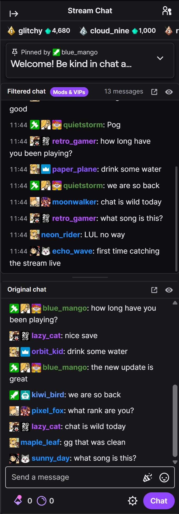
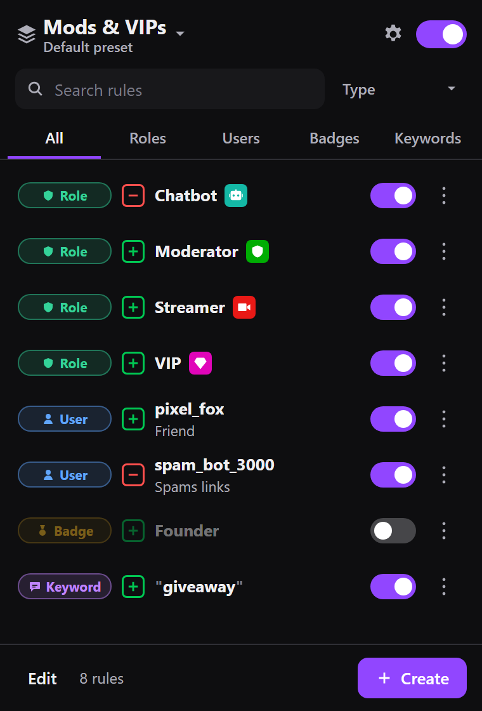
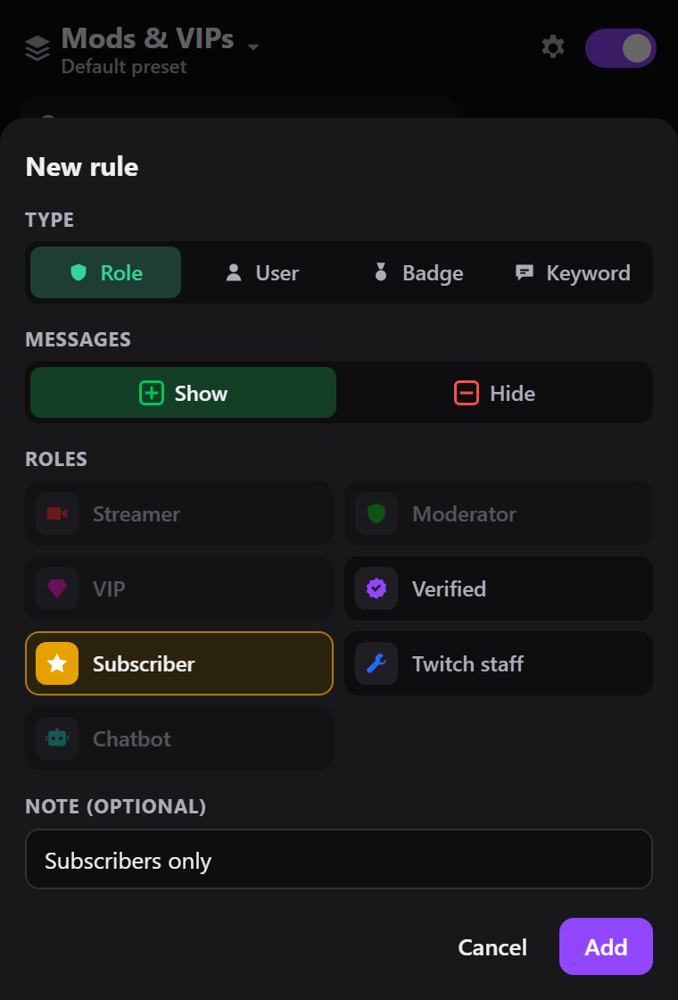

# Chat Filter for Twitch

A Chrome extension that adds a second, filtered chat to Twitch. It shows only the messages you care about: from chosen users, roles, badges or with keywords. The original chat stays right below it.

**[Install from the Chrome Web Store](https://chromewebstore.google.com/detail/chat-filter-for-twitch/mdkiolpdbimnpdjglhjlbhmfedjdbebm)** · [Русский](#русский)

  
  &nbsp;
  
  &nbsp;
  

## Features

- **Two chats in one column.** The filtered chat sits above the original one. Drag the divider to resize, hide either chat, or open it in a separate window.
- **Rules** by user, role (streamer, moderators, VIPs, verified, subscribers, Twitch staff, chatbots), badge name or keyword. Each rule either shows (+) or hides (−) messages, and hide rules win. Rules can be turned off without deleting them.
- **Presets.** Save sets of rules and bind a preset to channels, so it turns on automatically when you watch them. Presets can be copied to the clipboard and imported on another device.
- **Works like the real chat.** Badges, emotes, user cards, the message menu and VOD timestamps work in the filtered chat. The leaderboard and pinned messages stay above it.
- Live streams and VODs. English and Russian interface.

## Install

The extension is published in the Chrome Web Store: **[Chat Filter for Twitch](https://chromewebstore.google.com/detail/chat-filter-for-twitch/mdkiolpdbimnpdjglhjlbhmfedjdbebm)**. Install it from there to get automatic updates.

To run the latest code from this repository instead:

1. Download or clone this repository.
2. Open `chrome://extensions` and turn on **Developer mode**.
3. Click **Load unpacked** and select the project folder.

## Usage

Open a Twitch channel, click the extension icon and create rules with **Create**. You can also type a username in the search field and press Enter. Your own messages are always shown.

## Privacy

No servers, analytics or tracking. Settings are stored in your browser. See [PRIVACY.md](PRIVACY.md).

What changed between versions: [CHANGELOG.md](CHANGELOG.md).

## License

[GPL-3.0](LICENSE) © 2025-2026 Risher. You may use, change and share the code, but modified versions you distribute (including in extension stores) must stay open source under the same license.

---

## Русский

Расширение для Chrome, которое добавляет на Twitch второй, фильтрованный чат. В нём видны только нужные сообщения: от выбранных пользователей, ролей, со значками или ключевыми словами. Оригинальный чат остаётся под ним.

**Возможности**

- **Два чата в одной колонке.** Размер меняется перетаскиванием разделителя, любой чат можно скрыть или открыть в отдельном окне.
- **Правила** по нику, роли (стример, модераторы, VIP, подтверждённые, подписчики, команда Twitch, чат-боты), названию значка или ключевому слову. Правило показывает (+) или скрывает (−) сообщения, скрытие важнее. Правило можно выключить, не удаляя.
- **Наборы правил.** Набор можно привязать к каналам — он включится сам при просмотре их трансляций. Наборы копируются в буфер обмена и импортируются на другом устройстве.
- **Работает как обычный чат.** Значки, смайлы, карточки пользователей, меню сообщения и таймкоды VOD. Leaderboard и закреплённые сообщения остаются над фильтрованным чатом.

**Установка:** расширение опубликовано в Chrome Web Store — **[установить](https://chromewebstore.google.com/detail/chat-filter-for-twitch/mdkiolpdbimnpdjglhjlbhmfedjdbebm)**, обновления будут приходить автоматически. Чтобы запустить самый свежий код из репозитория: скачайте его, откройте `chrome://extensions`, включите **Режим разработчика**, нажмите **Загрузить распакованное расширение** и выберите папку проекта.

**Использование:** откройте канал на Twitch, нажмите на иконку расширения и создайте правила кнопкой **Создать** — или введите ник в поле поиска и нажмите Enter. Ваши собственные сообщения видны всегда.

**Лицензия:** [GPL-3.0](LICENSE). Код можно использовать, изменять и распространять, но изменённые версии (в том числе в магазинах расширений) должны оставаться открытыми под той же лицензией.
